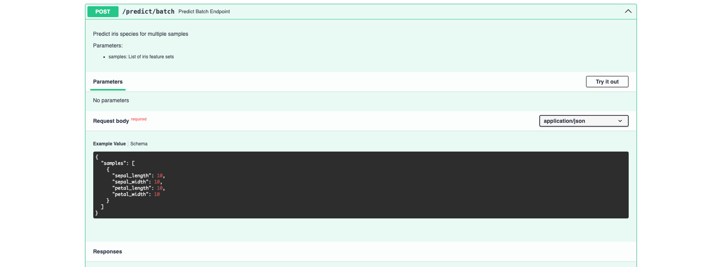

# Iris Classification API with FastAPI

A REST API for classifying Iris flowers using Decision Tree classifier built with FastAPI.

## Setup

1. **Create and activate virtual environment** (already done):
```bash
source fastapivenv/bin/activate
```

2. **Install dependencies**:
```bash
pip install -r requirements.txt
```

## Running the API
```bash
python main.py
```

The API will be available at `http://localhost:8002`

## API Documentation

Interactive API docs available at:
- Swagger UI: `http://localhost:8002/docs`
- ReDoc: `http://localhost:8002/redoc`

## Endpoints

### 1. Train Model
```bash
POST /train
```

Example:
```bash
curl -X POST "http://localhost:8002/train" \
  -H "Content-Type: application/json" \
  -d '{"max_depth": 4, "random_state": 42}'
```

### 2. Single Prediction
```bash
POST /predict
```

Example:
```bash
curl -X POST "http://localhost:8002/predict" \
  -H "Content-Type: application/json" \
  -d '{
    "sepal_length": 5.1,
    "sepal_width": 3.5,
    "petal_length": 1.4,
    "petal_width": 0.2
  }'
```

### 3. Batch Prediction
```bash
POST /predict/batch
```

Example:
```bash
curl -X POST "http://localhost:8002/predict/batch" \
  -H "Content-Type: application/json" \
  -d '{
    "samples": [
      {
        "sepal_length": 5.1,
        "sepal_width": 3.5,
        "petal_length": 1.4,
        "petal_width": 0.2
      },
      {
        "sepal_length": 6.7,
        "sepal_width": 3.0,
        "petal_length": 5.2,
        "petal_width": 2.3
      }
    ]
  }'
```

### 4. Get Info
```bash
GET /info
```

## Project Structure
```
FAST_API/
├── main.py                 # Application entry point
├── requirements.txt        # Dependencies
├── README.md              # Documentation
└── src/
    ├── __init__.py
    ├── main.py            # FastAPI app and endpoints
    ├── data.py            # Data loading and preprocessing
    ├── train.py           # Model training
    └── predict.py         # Prediction logic
```

## Features

- Decision Tree classifier for Iris dataset
- Single and batch predictions
- Model training endpoint with customizable parameters
- Input validation with Pydantic
- Automatic API documentation
- Classification probabilities and confidence scores
- Health check endpoint


## Screenshots

### API Running


### Training the Model


### Prediction


### Predict Batch 
