# MLOps Engineering — Lab Portfolio


> A collection of hands-on labs built during the **Data Analytics Engineering (MS)** program at **Northeastern University**, covering the full MLOps lifecycle: containerization, CI/CD automation, REST API development, interactive dashboards, workflow orchestration, and cloud infrastructure provisioning.

---

## 📁 Labs at a Glance

| # | Lab | Key Technologies | Concept |
|---|-----|-----------------|---------|
| 1 | [Docker Labs](#1-docker-labs--containerized-ml-service) | Docker, FastAPI, Streamlit | Multi-container ML app |
| 2 | [GitHub Actions CI/CD](#2-github-actions-cicd) | GitHub Actions, pytest, unittest | Automated testing pipelines |
| 3 | [FastAPI — Iris Classifier](#3-fastapi--iris-classification-api) | FastAPI, scikit-learn, Decision Tree | Production-grade ML REST API |
| 4 | [Streamlit — Iris Dashboard](#4-streamlit--iris-prediction-dashboard) | Streamlit, FastAPI, Random Forest | Full-stack ML application |
| 5 | [Apache Airflow](#5-apache-airflow--ml-pipeline-orchestration) | Airflow, Docker, DAGs | ML pipeline orchestration |
| 6 | [Terraform — AWS IaC](#6-terraform--aws-infrastructure-as-code) | Terraform, AWS S3, VPC | Infrastructure as Code |

---

## 1. Docker Labs — Containerized ML Service

**Path:** `Docker Labs 1&2/`

A fully containerized, two-tier ML prediction service demonstrating Docker networking, multi-container orchestration, and deployment to Docker Hub.

### Architecture
```
┌─────────────────────┐        ┌──────────────────────┐
│  Frontend (Streamlit)│◄──────►│  Backend (FastAPI)    │
│  Port: 8502          │  HTTP  │  Port: 8080           │
└─────────────────────┘        └──────────────────────┘
         Docker Network: mynetwork
```

### Features
- **FastAPI backend** — `/predict` and `/health` REST endpoints
- **Streamlit frontend** — interactive sliders for feature input and real-time prediction display
- **Docker Compose** — single-command deployment with service discovery
- **Docker Hub** — images published at `regata3010/regata-docker` (`backend` / `frontend` tags)

### Quick Start
```bash
# Option 1: Docker Compose
docker-compose up
# → Frontend: http://localhost:8502

# Option 2: Pull from Docker Hub
docker network create mynetwork
docker run -d --name backend --network mynetwork -p 8080:8080 regata3010/regata-docker:backend
docker run -d --name frontend --network mynetwork -p 8502:8502 \
  -e BACKEND_URL=http://backend:8080 regata3010/regata-docker:frontend
```

### Stack
`Python 3.9` · `FastAPI` · `Streamlit` · `Docker` · `Docker Compose`

### Screenshots
> Run the app to see it in action — the Streamlit UI connects live to the FastAPI backend over the Docker network.

---

## 2. GitHub Actions CI/CD


**Path:** `GitActionsLab/IE7374-GitActionsLab/`

Implements a full CI/CD pipeline using GitHub Actions with two parallel testing workflows that automatically trigger on every push to `main`.

### Workflows

| Workflow | Framework | Trigger | Artifact |
|----------|-----------|---------|----------|
| `pytest_action.yml` | pytest | push → main | `pytest-report.xml` |
| `unittest_action.yml` | unittest | push → main | `unittest-report.xml` |

### Pipeline Steps
```
push to main → checkout → setup Python 3.8 → install deps → run tests → upload report → notify
```

### Calculator Module (`src/calculator.py`)
```python
fun1(x, y)  # Addition
fun2(x, y)  # Subtraction
fun3(x, y)  # Multiplication
fun4(x, y)  # Sum of all operations
```

### Run Locally
```bash
pip install -r requirements.txt
pytest test/test_pytest.py                 # pytest
python -m unittest test.test_unittest      # unittest
```

### Stack
`Python 3.8` · `pytest` · `unittest` · `GitHub Actions`

### Screenshots
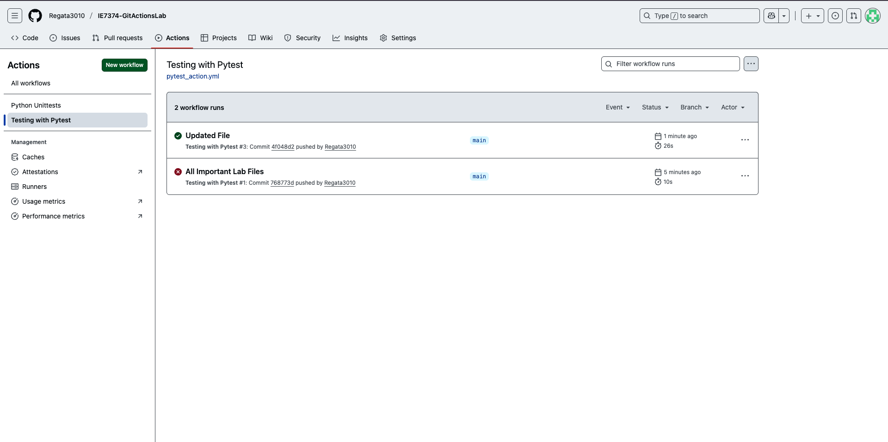
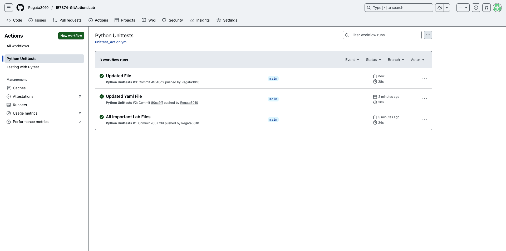

---

## 3. FastAPI — Iris Classification API

**Path:** `FAST_API/`

A production-grade REST API for Iris flower classification using a Decision Tree model, exposing training, single prediction, and batch prediction endpoints with full input validation via Pydantic.

### API Endpoints

| Method | Endpoint | Description |
|--------|----------|-------------|
| `GET` | `/` | API status & endpoint map |
| `GET` | `/info` | Dataset and model metadata |
| `GET` | `/health` | Health check |
| `POST` | `/train` | Train Decision Tree (configurable depth) |
| `POST` | `/predict` | Single sample prediction with probabilities |
| `POST` | `/predict/batch` | Batch inference for multiple samples |

### Example Request
```bash
# Train
curl -X POST http://localhost:8002/train -H "Content-Type: application/json" \
  -d '{"max_depth": 4, "random_state": 42}'

# Predict
curl -X POST http://localhost:8002/predict -H "Content-Type: application/json" \
  -d '{"sepal_length": 5.1, "sepal_width": 3.5, "petal_length": 1.4, "petal_width": 0.2}'
```

### Run
```bash
pip install -r requirements.txt
python run.py
# → Swagger UI: http://localhost:8002/docs
```

### Stack
`FastAPI` · `scikit-learn` · `Decision Tree` · `Pydantic` · `joblib` · `Uvicorn`

### Screenshots
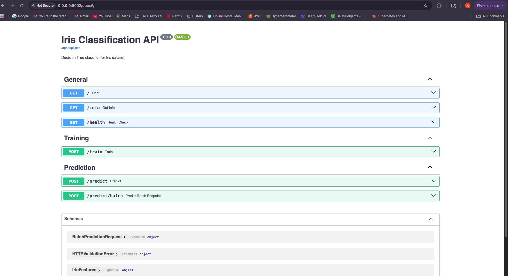
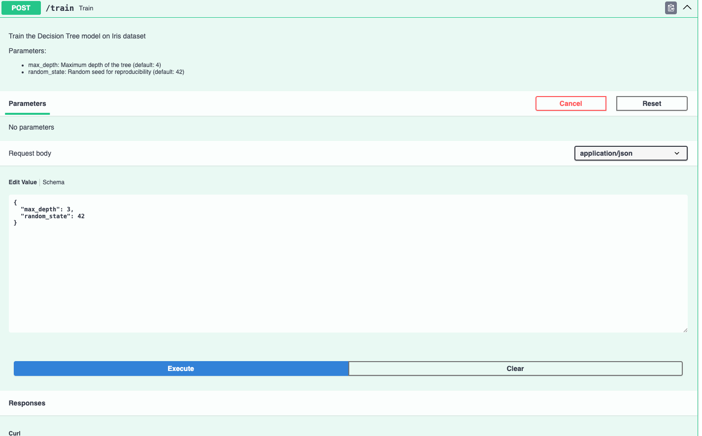
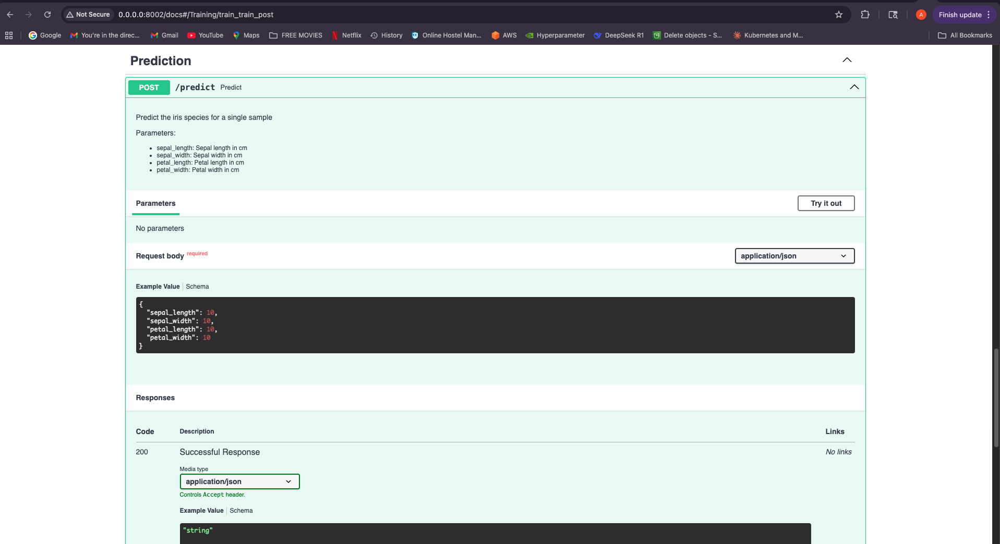


---

## 4. Streamlit — Iris Prediction Dashboard

**Path:** `StreamlitLab/`

A full-stack ML application combining a FastAPI inference backend with an interactive Streamlit dashboard for real-time Iris species prediction.

### Architecture
```
Streamlit Dashboard (port 8501)
        │  POST /predict
        ▼
FastAPI Backend (port 8080)
        │  loads
        ▼
  iris_model.pkl  (Random Forest, ~95% accuracy)
```

### Features
- **Live backend health indicator** in sidebar
- **Interactive sliders** for all 4 flower measurements
- **Instant species prediction** (Setosa / Versicolor / Virginica)
- **Model persistence** via pickle serialization

### Run
```bash
pip install -r requirements.txt

# Terminal 1 — train and start backend
python src/train.py
python -m uvicorn src.main:app --port 8080

# Terminal 2 — start frontend
streamlit run src/dashboard.py
# → http://localhost:8501
```

### Model Performance
| Metric | Value |
|--------|-------|
| Algorithm | Random Forest (100 estimators) |
| Test Accuracy | ~95% |
| Classes | Setosa, Versicolor, Virginica |
| Features | Sepal L/W, Petal L/W |

### Stack
`Streamlit` · `FastAPI` · `scikit-learn` · `Random Forest` · `pickle`

### Screenshots
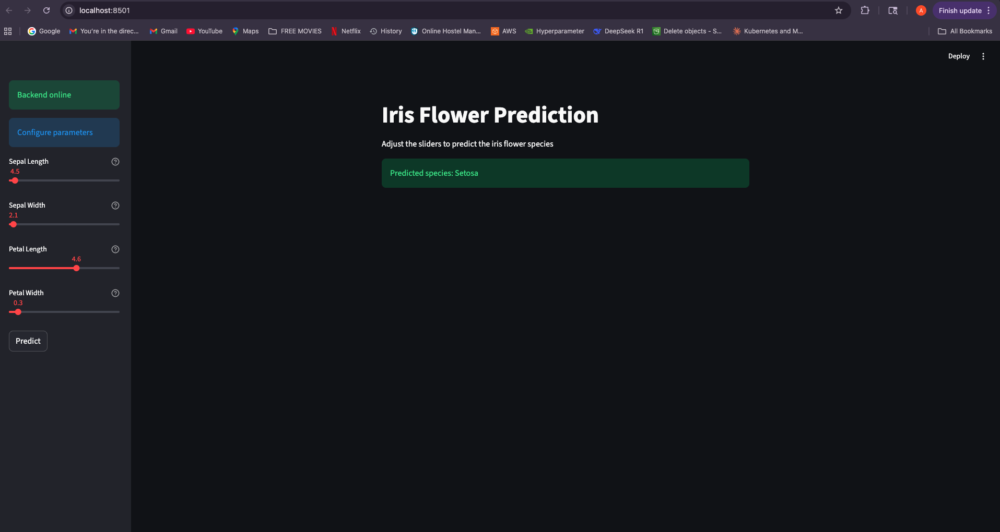
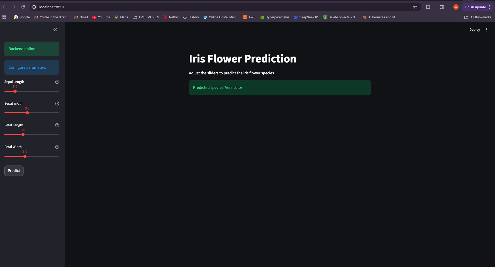
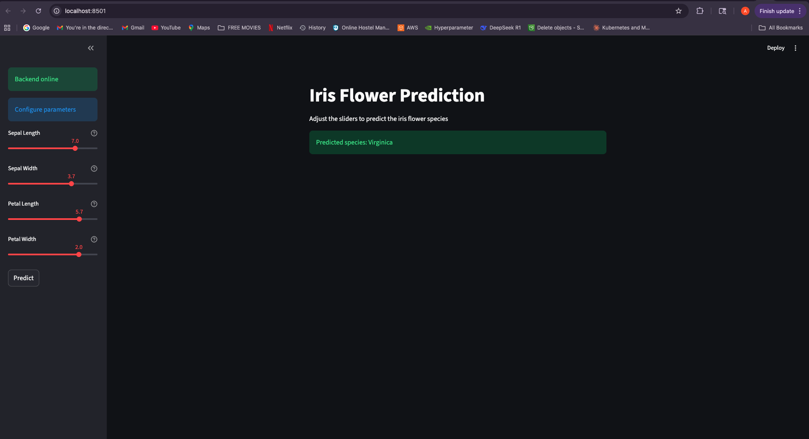

---

## 5. Apache Airflow — ML Pipeline Orchestration

**Path:** `Airflow Lab/`

An end-to-end ML pipeline orchestrated as an Airflow DAG (`simple_ml_pipeline`), demonstrating task dependency management, XCom data passing between tasks, and containerized Airflow deployment.

### DAG: `simple_ml_pipeline`

```
load_data_task → process_data_task → train_model_task → evaluate_save_task
```

| Task | Function | Description |
|------|----------|-------------|
| `load_data_task` | `load_data()` | Simulates ingesting 1,000 records |
| `process_data_task` | `process_data()` | Cleans and transforms data via XCom |
| `train_model_task` | `train_model()` | Trains model; returns accuracy, precision, recall |
| `evaluate_save_task` | `evaluate_and_save()` | Deploys if accuracy > 0.85, else rejects |

### Run with Docker
```bash
docker build -t airflow-lab .
docker-compose up
# → Airflow UI: http://localhost:8080
# Trigger DAG: simple_ml_pipeline
```

### Stack
`Apache Airflow 2.8.0` · `Docker` · `Python` · `scikit-learn` · `pandas`

### Screenshots
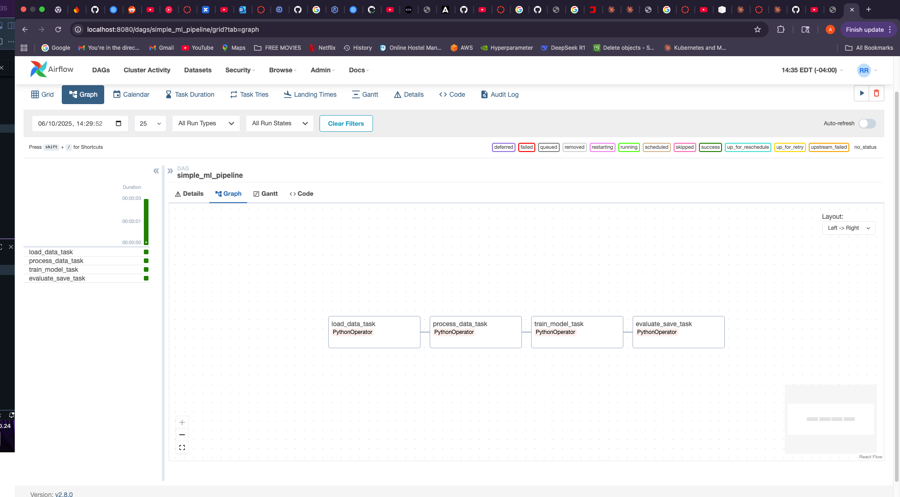
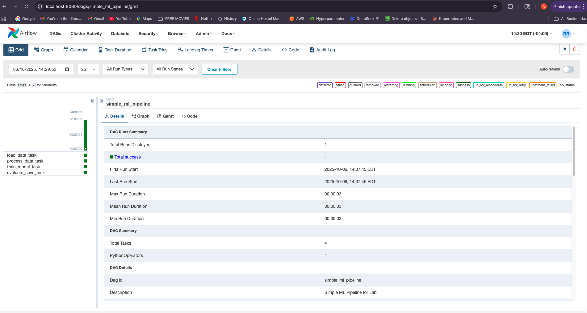

---

## 6. Terraform — AWS Infrastructure as Code

**Path:** `Terraform Lab/`

Provisions and manages AWS cloud infrastructure declaratively using Terraform, demonstrating the complete IaC lifecycle: write → plan → apply → modify → destroy.

### Resources Provisioned

```hcl
aws_s3_bucket   "my_bucket"   # S3 bucket with environment tags
aws_vpc         "myvpc"       # VPC with CIDR 10.0.0.0/16
aws_subnet      "mysubnet1"   # Subnet with CIDR 10.0.1.0/24
```

### Workflow
```bash
terraform init             # Download AWS provider
terraform plan             # Preview changes
terraform apply -auto-approve  # Provision resources
terraform destroy -auto-approve  # Tear down all resources
```

### Key Concepts Demonstrated
- **Declarative IaC** — resources defined in `main.tf`
- **Resource dependencies** — subnet references VPC via `aws_vpc.myvpc.id`
- **State management** — `terraform.tfstate` tracks live infrastructure
- **Idempotency** — repeated applies produce consistent results
- **Credential security** — AWS keys passed via environment variables

### Stack
`Terraform` · `AWS S3` · `AWS VPC` · `AWS Subnet` · `HCL`

### Screenshots
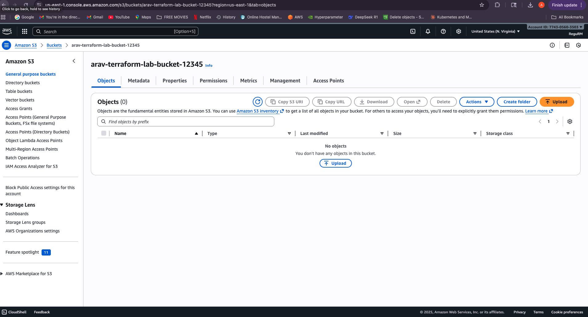
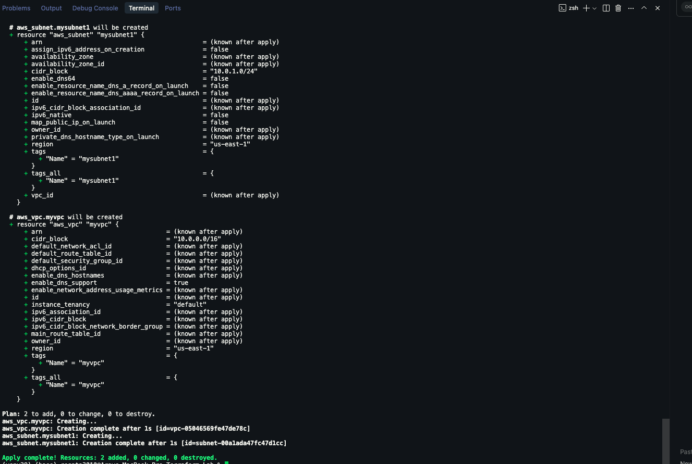


---

## 🛠 Full Tech Stack

| Category | Technologies |
|----------|-------------|
| **Languages** | Python 3.8 / 3.9 / 3.11 |
| **ML / Data** | scikit-learn, pandas, NumPy, joblib |
| **APIs** | FastAPI, Uvicorn, Pydantic |
| **Frontend** | Streamlit |
| **Containerization** | Docker, Docker Compose |
| **CI/CD** | GitHub Actions |
| **Orchestration** | Apache Airflow |
| **IaC / Cloud** | Terraform, AWS (S3, VPC, Subnet) |
| **Testing** | pytest, unittest |

---

## 🚀 Getting Started

Each lab is self-contained. Navigate to the relevant directory and follow the **Quick Start** instructions in that section.

```bash
git clone <repo-url>
cd "MLOps"

# Example: run the FastAPI lab
cd FAST_API
pip install -r requirements.txt
python run.py
```

---

## 👤 Author

**Arav Pandey**  
M.S. Data Analytics Engineering · Northeastern University

---

*Built as part of the MLOps curriculum — covering containerization, automation, serving, orchestration, and cloud infrastructure.*
