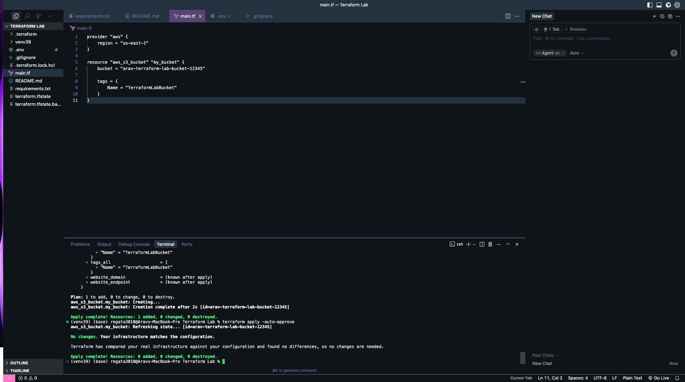
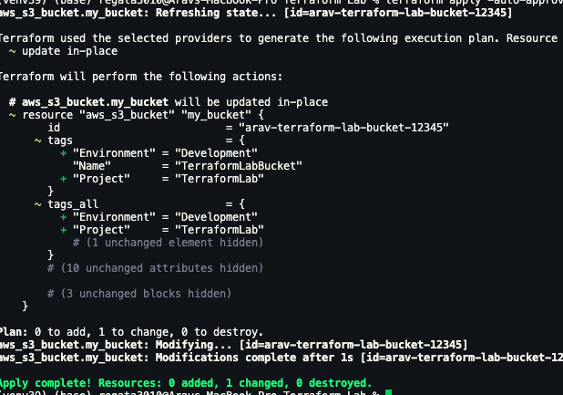
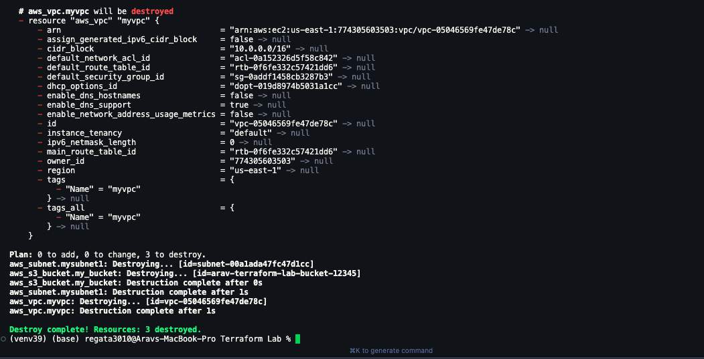

# Terraform Lab Assignment

## Overview
This lab demonstrates fundamental Terraform concepts including infrastructure provisioning, modification, and destruction using AWS resources.

## Prerequisites
- AWS Account with IAM credentials
- Terraform installed locally
- AWS IAM permissions: S3 and VPC access

## Setup

### 1. Install Terraform
```bash
brew install terraform
terraform --version
```

### 2. Configure AWS Credentials
```bash
export AWS_ACCESS_KEY_ID="your-access-key"
export AWS_SECRET_ACCESS_KEY="your-secret-key"
```

## Lab Execution

### Part 1: Initialize Terraform
```bash
mkdir terraform-lab-aws
cd terraform-lab-aws
terraform init
```

### Part 2: Create S3 Bucket
Created initial S3 bucket resource with basic configuration.
```bash
terraform plan
terraform apply -auto-approve
```

### Part 3: Modify Resources
Added additional tags to demonstrate resource modification without recreation.
```bash
terraform apply -auto-approve
```

### Part 4: Add Multiple Resources
Extended infrastructure by adding VPC and Subnet resources, demonstrating:
- Resource dependencies (`vpc_id = aws_vpc.myvpc.id`)
- CIDR block configuration
- Multiple resource management

### Part 5: State Management
Terraform automatically created `terraform.tfstate` file to track infrastructure state. This file is critical for managing resources and should never be manually edited.

### Part 6: Destroy Infrastructure
```bash
terraform destroy -auto-approve
```

## Key Learnings

1. **Infrastructure as Code**: Defined cloud resources declaratively in `.tf` files
2. **State Management**: Terraform tracks resource state in `terraform.tfstate`
3. **Idempotency**: Running apply multiple times with same config produces consistent results
4. **Resource Dependencies**: Terraform automatically handles creation order based on dependencies
5. **Change Planning**: `terraform plan` shows changes before applying them

## Files Generated
- `main.tf` - Infrastructure configuration
- `terraform.tfstate` - Current infrastructure state (should be in `.gitignore`)
- `.terraform/` - Provider plugins and modules
- `.terraform.lock.hcl` - Provider version lock file

## Resources Created
- AWS S3 Bucket with tags
- AWS VPC with CIDR block 10.0.0.0/16
- AWS Subnet within VPC with CIDR block 10.0.1.0/24

## Challenges Encountered
- **IAM Permissions**: Initial attempts to create EC2 instances failed due to insufficient permissions. Pivoted to S3 buckets and later added VPC permissions.
- **Credential Management**: Learned proper handling of AWS credentials via environment variables.

## Conclusion
Successfully demonstrated Terraform's core workflow: write → plan → apply → modify → destroy. The lab reinforced Infrastructure as Code principles and proper state management practices essential for modern DevOps.


## Screenshots





---
**Author**: Arav Pandey
**Date**: November 3, 2025  
**Course**: Data Analytics Engineering
EOF